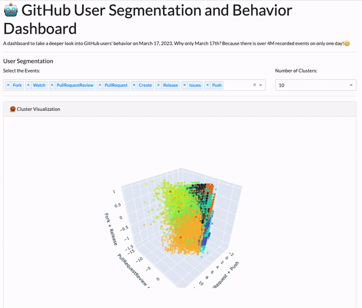

[](https://opensource.org/licenses/MIT)
# 🤖 GitHub User Segmentation
What if I tell you that there are two segments of users on Github on March 17th, 2023? Pushers and Pullers!

The GitHub User Segmentation dashboard provides valuable insights into user behavior on GitHub, allowing developers and project managers to optimize their workflows, improve user engagement, and make data-driven decisions. By analyzing user activity and engagement across repositories, the dashboard enables users to identify behavior pattern changes, and gain a better understanding of how different user segments are interacting with their projects. With the help of the GitHub User Segmentation dashboard, users can make informed decisions based on real-time insights, and provide a better overall user experience for their GitHub users.



-   [Motivation](#motivation)
-   [See it live](#explore-the-app)
-   [Description](#description)
-   [About the data](#about-the-data)
-   [Usage](#usage)
-   [Contributing](#contributing)

## Motivation 
The motivation behind the development of the GitHub User Segmentation dashboard is to provide users with a comprehensive tool to analyze and understand user behavior on GitHub, enabling them to optimize their workflows, improve user engagement, and make data-driven decisions.

## Explore the app 
You can access the deployed app on [https://github-user-segmentation.onrender.com/](https://github-user-segmentation.onrender.com/)
## Description 
The interactive dashboard includes five major section.
1. Control toolbox: In this section, you see two dropdown menus that you can use to control the parameter of the ML clustering algorithm. The first drop-down controls the initial events that you want to include and segments your users based on those event types. The second dropdown controls the number of desired clusters for the K-means algorithm. So you might want to try a different number of clusters to see the effect of the segmentation analysis.
2. The clusters in 3D format. All of the axes are the primary components of the PCA model they are descriptive of the top two features affecting the primary component.
3. The visualization of PCA components shows the importance of each feature to the principle components.
4. Control toolbox for Sankey Diagram: In this section, you see three dropdown menus that you can use to control the parameter Sankey plotting. The first drop-down controls the initial events that you want to include and plots the behavior flow based on that. The second dropdown controls the number of desired steps for behavior analysis. The third dropdown controls the depth of the event at each step. So you might want to try a different number of steps and depth to see the effect of the user behavior analysis.
5. The sankey diagram that shows the behavior flow of the user between different actions.
## About the Data 
The data to build this dashboard originated from [GitHub Archive](https://www.gharchive.org/). Since the size of the data was over 20GB/day, I decided to move forward with the data of March 17th, 2023 data which included over 4 Million events.
The [structure of the datasets](https://github.com/igrigorik/gharchive.org/blob/master/bigquery/schema.js) mentioned above includes separate columns for standard activity fields (as seen in the same response format), a "payload" string field that holds the activity description in JSON encoded format, and an additional "other" string field that encompasses all remaining fields.
After doing a series of data wrangling tasks, the final dataset columns are the name of a specific event including `Fork`, `Watch`, `PullRequestReview`, `PullRequest` `Create`, `Release`, `Issues`, `Push` and each of the rows is user IDs and the cells contain the count of each event per user.

## Usage
To load the dashboard locally, follow the steps below:
1. Clone the current `github_user_segmentation` repository.
2. Install Conda environment `gh_us.yaml` by running:

    ``` bash
    conda env create -f gh_us.yaml
    ```

3. Activate it by running:

    ``` bash
    conda activate gh_us
    ```

4. In the main directory run:

    ``` bash
    python src/app.py
    ```
    
5. Load the URL provided by Dash app which is usually [http://127.0.0.1:8050/](http://127.0.0.1:8050/)

## Contributing 
Interested in contributing? We are glad you are interested, please check out the [contributing guidelines](https://github.com/mrnabiz/github_user_segmentation/blob/main/CONTRIBUTING.md). Please note that this project is released with a [Code of Conduct](https://github.com/mrnabiz/github_user_segmentation/blob/main/CODE_OF_CONDUCT.md). By contributing to this project, you agree to abide by its terms.

## License
`github_user_segmentation` was created by [Mohammad Reza Nabizadeh](https://nabi.me). The materials of this project are licensed under the MIT License. If re-using/re-mixing please provide attribution and link to this webpage.
